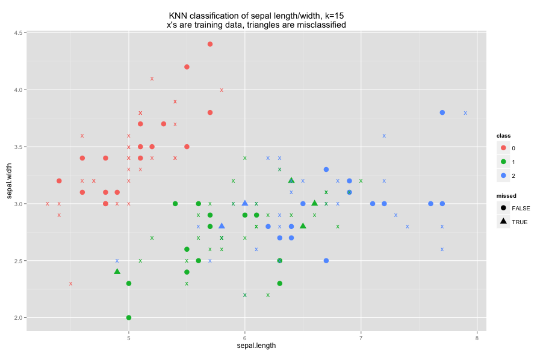

This is an implementation of the k-nearest-neighbors algorithm in scalding.

## Example

Here's an example using the familiar "iris" dataset.

```scala
class KnnExampleJob(args: Args) extends Job(args) {
  val k = args.getOrElse("k", "15").toInt

  // load up the iris dataset
  val iris = Tsv("iris.tsv", ('id, 'class, 'sepalLength, 'sepalWidth, 'petalLength, 'petalWidth))
    .read
    // Just use 2 of the features so we can visualize them easier. Need to convert them to Points
    .map(('sepalLength, 'sepalWidth) -> 'point) {tup: (Double, Double) => Point(tup._1, tup._2)}
    .project('id, 'class, 'point)

  // use 2/3 of the data as a training set
  val irisTrain = iris.filter('id){id: Int => (id % 3) != 0}

  // build the test set as the inverse of the training set, and discard the 'class Field
  val irisTest = iris
    .filter('id){id: Int => (id % 3) ==0}
    .discard('class)

  // prepare the model
  val model = Knn.fit(irisTrain, 'point, 'class)
  
  // apply the model
  val predictions = Knn.classify(irisTest, model, 'point, 'id, k)(Distance.euclidean)

  // figure out how well we did
  val output = predictions
    .rename('class -> 'classPred)
    .joinWithTiny('id -> 'id, iris)
    .map('point -> ('sepalLength, 'sepalWidth)) {x: Point => (x.coord(0), x.coord(1))}
    .project('id, 'class, 'classPred, 'sepalLength, 'sepalWidth)
    .write(Tsv("iris_pred.tsv"))

}
```

The results match what scikit-learn produces. Here's a plot of the result:



## A word of warning

I use the `crossWithTiny` method in here in order to compare all of the points from the test set to all of the points in the training set. So if your data has `N` points in the training set (model) and you want to classify `M` points, you will actually create `N*M` rows of data at some point. So, don't make your training set too large!

Also, I haven't tested this on a hadoop cluster yet or on any datasets besides iris. I'll hopefully be removing this sentence in the next few days.
